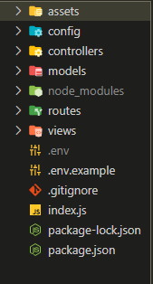
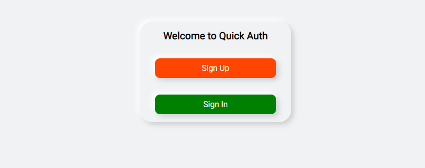
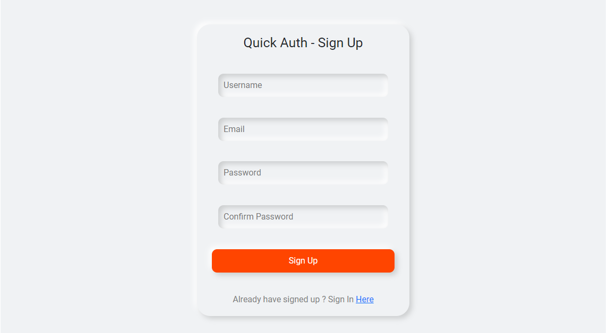
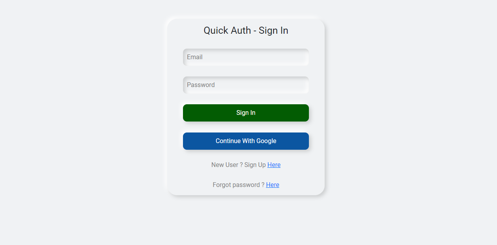
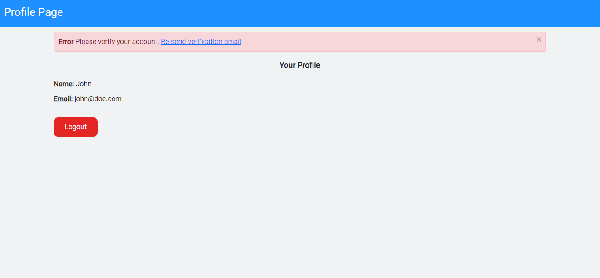
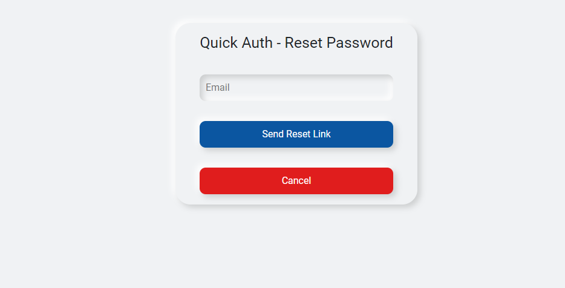
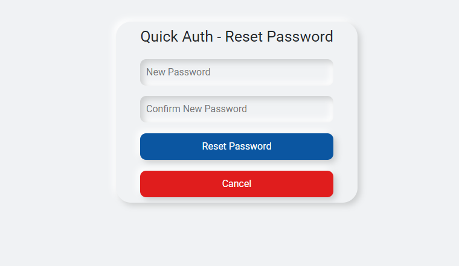

# quick-auth
- This is a complete authentication system which can be used as a starter code for creating any new application.
- This project is built using `Nodejs(Express.js)`, `MongoDB` and `Passportjs`.

# Features
- Sign Up with email.
- Sign In with email.
- Sign in using Google account.
- Sign out.
- Reset Password.
- Send mail to email for reset password link.
- Display notification for unmatching passwords, incorrect password during sign in.

# Screenshots
- Directory Structure

- Landing Page

- Sign Up Page

- Sign In Page

- Profile Page

- Reset Password Page

# Steps to setup the project on local system
- Clone the project for github onto your local system.
- open the project with VS Code and run `npm install` command on the terminal in the same project folder.
- Go through the example .env file and create a .env file, fill in your credential.
- Now, you can run the project using `npm start` command.
